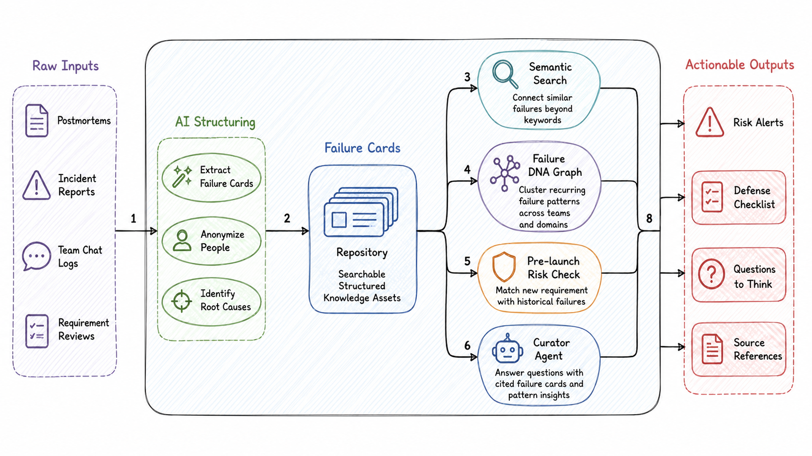

<p align="center">
  
</p>

<h1 align="center">失败博物馆 · Failure Museum</h1>

<p align="center">
  <strong>把团队踩过的坑，变成下一次上线前会主动提醒你的知识资产。</strong>
</p>

<p align="center">
  <em>Failure Museum · Turn your team's past failures into pre-launch reminders.</em>
</p>

<p align="center">
  
  
  
  
  
  
  
  
</p>

<p align="center">
  <a href="#-核心能力">功能</a> ·
  <a href="#-快速开始">快速开始</a> ·
  <a href="#-架构一览">架构</a> ·
  <a href="#-api-概览">API</a> ·
  <a href="#-路线图">路线图</a>
</p>

---

> 成功会被展示，失败却最容易流失。
> 失败不是负资产，**未被复用的失败**才是负资产。

失败博物馆是一个面向团队复盘、需求评审和上线前风险预警的 AI Demo。它把零散的复盘、群聊、事故记录结构化为「失败卡」，再通过语义检索、图谱聚类和馆长对话，把历史失败变成可搜索、可引用、可预警的组织记忆。

当你输入一个新需求时，它会主动匹配历史上相似的失败，生成风险提示、防坑清单和需要继续追问的问题，让复盘不只停在事后总结，而是在下一次上线前真正发挥作用。

## 目录

- [为什么做它](#为什么做它)
- [核心能力](#-核心能力)
- [适合谁](#适合谁)
- [产品视图](#产品视图)
- [快速开始](#-快速开始)
- [架构一览](#-架构一览)
- [技术栈](#技术栈)
- [目录结构](#目录结构)
- [API 概览](#-api-概览)
- [数据模型：失败卡](#数据模型失败卡)
- [开发命令](#开发命令)
- [路线图](#-路线图)
- [项目状态](#项目状态)
- [致谢与许可](#致谢与许可)

## 为什么做它

很多团队并不缺少复盘，缺少的是让复盘被再次使用的机制：

- 事故文档沉在飞书、Notion、群聊和工单里，下一次类似需求出现时没人记得。
- 复盘常常归因到个人或偶然事件，真正可复用的机制层教训没有被抽取。
- 需求评审更关注收益和排期，历史上的失败模式很少被系统性带入讨论。
- 组织重复踩同一类坑，但缺少一张能看见「反复发生」的全局图谱。

失败博物馆把每次失败沉淀成一个可计算的单元：失败卡。它不追责个人，而是提炼机制、信号和清单。

## ✨ 核心能力

| 能力 | 说明 |
| --- | --- |
| 🏛️ 失败卡展厅 | 浏览、搜索、筛选团队历史失败，查看背景、根因、影响、预警信号和防坑清单。 |
| 🤖 AI 结构化录入 | 粘贴复盘、群聊、事故记录，自动生成失败卡草稿，人工确认后入馆。 |
| 🔍 语义检索 | 基于 embedding + cosine similarity 检索相似失败，不只依赖关键词匹配。 |
| 🩺 上线前体检 | 输入新需求，匹配历史失败并输出风险预警、检查清单和追问问题。 |
| 🧬 失败基因图谱 | 用相似度建边，用社区发现聚类，提炼跨业务反复出现的失败模式。 |
| 🗿 问馆长 | 一个带工具调用的 RAG 对话入口，可检索失败卡、查看失败模式并给出来源引用。 |
| 🔌 无 Key 可演示 | 未配置 API Key 时自动使用本地 fallback embedding 和规则化生成，方便离线演示。 |

## 适合谁

- 产品、研发、测试、运维、安全团队：把线上事故和需求复盘沉淀为可复用资产。
- 技术管理者：观察组织层面的系统性风险，而不是只看单次事故。
- 黑客松 / 路演 Demo：完整覆盖录入、检索、风险评估、图谱和对话闭环。

## 产品视图

当前前端包含 5 个主要页面：

| 页面 | 路由 | 用途 |
| --- | --- | --- |
| 展厅 | `/` | 查看失败卡、统计信息、场景筛选与语义搜索。 |
| 失败图谱 | `/graph` | 展示失败卡之间的相似关系和聚类后的失败模式。 |
| 问馆长 | `/curator` | 与馆长对话，基于馆藏回答并引用来源失败卡。 |
| 上线前体检 | `/risk` | 输入新需求，生成风险报告与防坑清单。 |
| 录入失败 | `/ingest` | 将原始文本结构化为失败卡草稿并发布入馆。 |

推荐演示路径：

1. 在「展厅」浏览预置失败卡，观察严重级别、场景和标签。
2. 进入「失败图谱」，查看系统如何把多张失败卡聚类成失败模式。
3. 在「问馆长」里提问：`我们在支付上反复踩过哪些坑？`
4. 在「上线前体检」输入：`邀请奖励功能：老用户邀请新用户，双方各得现金奖励`。
5. 点击风险报告中的来源失败卡，回到具体历史案例。
6. 在「录入失败」粘贴一段复盘原文，生成并发布新的失败卡。

## 🚀 快速开始

### 1. 启动后端

```powershell
cd backend
python -m venv .venv
.\.venv\Scripts\Activate.ps1
pip install -r requirements.txt

copy .env.example .env

# 可选：灌入演示失败卡
python -m app.seed_data --reset

# 启动 API
uvicorn app.main:app --reload
```

后端默认运行在：

- API: `http://127.0.0.1:8000`
- Swagger: `http://127.0.0.1:8000/docs`

### 2. 启动前端

```powershell
cd frontend
npm install
npm run dev
```

前端默认运行在 `http://localhost:5173`，并通过 Vite proxy 将 `/api` 转发到 `http://127.0.0.1:8000`。

### 3. 运行冒烟测试

先保持后端运行，然后执行：

```powershell
cd backend
python smoke_test.py
```

脚本会检查健康状态、失败卡统计、语义搜索和上线前体检，并生成 `backend/smoke_result.json`。

### AI 配置

复制 `backend/.env.example` 为 `backend/.env` 后配置：

```env
LLM_API_KEY=
LLM_BASE_URL=https://api.openai.com/v1
LLM_CHAT_MODEL=gpt-4o-mini

EMBED_API_KEY=
EMBED_BASE_URL=
EMBED_MODEL=text-embedding-3-small
```

说明：

- `LLM_*` 用于失败卡抽取、风险报告生成、馆长对话和失败模式命名。
- `EMBED_*` 用于向量化与语义检索。未设置时会复用 `LLM_API_KEY` 和 `LLM_BASE_URL`。
- 未配置任何 API Key 时，系统仍可运行：embedding 使用本地 hash bag-of-words，生成逻辑走规则降级，适合演示但语义质量会下降。
- 只要服务兼容 OpenAI API 格式，就可以切换到 DeepSeek、通义千问 DashScope 等模型服务。

## 🏗️ 架构一览

<p align="center">
  
</p>

后端是 FastAPI，前端是 Vite + React + TypeScript。数据默认保存在本地 JSON 文件中，不依赖外部数据库；embedding 会随失败卡一起持久化，图谱模式命名结果会缓存到 `patterns.json`。

## 技术栈

| 层 | 技术 |
| --- | --- |
| 前端 | React 18, TypeScript, Vite, Tailwind CSS, react-router-dom |
| 图谱 | react-force-graph-2d |
| 后端 | Python 3.12, FastAPI, Pydantic |
| 检索 | OpenAI-compatible embedding 或本地 hash fallback embedding |
| 聚类 | networkx greedy modularity communities |
| LLM | OpenAI-compatible Chat API，可切换 OpenAI / DeepSeek / 通义千问 DashScope 等 |
| 存储 | 本地 JSON：`backend/data/cards.json`、`backend/data/patterns.json` |

## 目录结构

```text
failure-museum/
├─ backend/
│  ├─ app/
│  │  ├─ main.py              # FastAPI 入口、CORS、路由挂载
│  │  ├─ config.py            # .env 配置
│  │  ├─ schemas.py           # FailureCard / RiskReport / GraphData 等模型
│  │  ├─ llm.py               # Chat / embedding 客户端与 fallback 能力
│  │  ├─ store.py             # 本地 JSON 存储、向量相似度查询
│  │  ├─ routers/             # cards / search / risk / graph / curator API
│  │  └─ services/            # ingest / search / risk / graph / curator 业务逻辑
│  ├─ data/                   # 本地数据文件
│  ├─ requirements.txt
│  └─ smoke_test.py           # API 冒烟测试脚本
├─ frontend/
│  ├─ src/
│  │  ├─ pages/               # Gallery / Graph / Curator / RiskCheck / Ingest / CardDetail
│  │  ├─ components/          # 卡片、徽章、Markdown、风险报告等组件
│  │  ├─ api.ts               # 前端 API client 与类型定义
│  │  └─ App.tsx              # 全局布局与导航
│  ├─ package.json
│  └─ vite.config.ts          # /api 代理到 FastAPI
├─ tools/
│  └─ to_utf8.py              # 将 UTF-16 / BOM 文件归一为 UTF-8
├─ cover.png                  # 项目封面
└─ framework.png              # 架构图
```

## 📡 API 概览

| Method | Endpoint | 说明 |
| --- | --- | --- |
| `GET` | `/api/health` | 健康检查与当前 AI 配置状态。 |
| `GET` | `/api/cards` | 获取失败卡列表。 |
| `GET` | `/api/cards/stats` | 获取失败卡统计信息。 |
| `GET` | `/api/cards/{id}` | 获取单张失败卡详情。 |
| `POST` | `/api/cards/ingest` | 将原始文本结构化为失败卡草稿，不入库。 |
| `POST` | `/api/cards` | 创建或发布失败卡。 |
| `PUT` | `/api/cards/{id}` | 更新失败卡并重建 embedding。 |
| `POST` | `/api/search` | 语义搜索失败卡。 |
| `POST` | `/api/risk-check` | 对新需求做上线前风险体检。 |
| `GET` | `/api/graph` | 获取图谱节点、边和聚类后的失败模式。 |
| `GET` | `/api/graph/patterns` | 获取失败模式列表。 |
| `POST` | `/api/curator/chat` | 馆长对话，返回回答、引用卡片和工具轨迹。 |

## 数据模型：失败卡

每张失败卡都尽量回答同一组问题：

```json
{
  "id": "fc_seed_001",
  "title": "失败标题",
  "one_line": "一句话教训",
  "scenario": "业务场景",
  "tags": ["失败模式标签"],
  "tech_domains": ["涉及技术域"],
  "severity": "P0/P1/P2/P3",
  "context": "背景",
  "what_happened": "失败经过",
  "root_cause": "机制层面的根因",
  "impact": "影响",
  "warning_signals": ["预警信号"],
  "checklist": ["下一次可执行的防坑清单"]
}
```

设计原则：

- 根因落到流程、机制、技术和产品边界，不指向具体个人。
- 预警信号写成上线前或运行中可以观察到的指标。
- 防坑清单写成下一次需求评审可以直接勾选的动作。

## 开发命令

后端：

```powershell
cd backend
python -m app.seed_data --reset
uvicorn app.main:app --reload
python smoke_test.py
```

前端：

```powershell
cd frontend
npm run dev
npm run build
npm run preview
```

编码归一：

```powershell
python tools\to_utf8.py .
```

如果 Windows 编辑器把含中文的文件保存成 UTF-16，运行上面的脚本可以归一为 UTF-8。

## 🗺️ 路线图

- 更强的 rerank 与混合检索，提升相似失败命中质量。
- 标签归一、人工审核流和失败卡版本历史。
- 接入 IM、工单、监控告警，自动发现可沉淀的失败素材。
- 在需求评审或发布流程中自动触发上线前体检。
- 多团队、多空间、权限和敏感信息脱敏策略。
- 图谱中支持按时间、团队、技术域和严重级别进行多维过滤。

## 项目状态

这是一个可运行的本地 Demo，重点展示「失败知识资产化」的完整产品闭环。默认使用本地 JSON 存储，适合路演、黑客松和小团队试验；若要用于生产环境，建议补充鉴权、数据库、审计、脱敏策略和更完整的测试体系。

## 致谢与许可

- 后端检索与聚类基于 [FastAPI](https://fastapi.tiangolo.com/)、[networkx](https://networkx.org/) 与 OpenAI-compatible 模型服务。
- 前端图谱可视化基于 [react-force-graph](https://github.com/vasturiano/react-force-graph)。
- 本项目以 MIT License 开源，欢迎自由使用、修改与分发。

<p align="center">
  <sub>失败不是负资产，未被复用的失败才是 · 收藏教训，不追责个人</sub>
</p>
